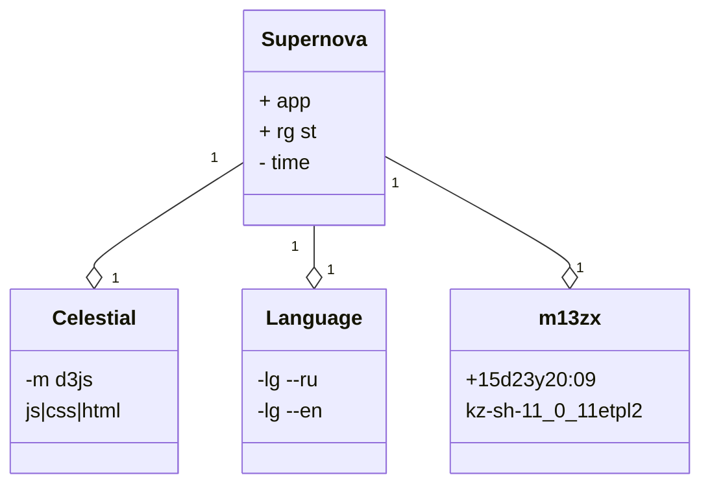

## Constellations for the "Supernova" application on d3js.
### Many thanks to Olaf Frohn, Mike Bostock and Jason Davies.

```mermaid
classDiagram
    Supernova "1" --o "1" Celestial
    Supernova "1" --o "1" Language
    Supernova "1" --o "1" m13zx
    Supernova : + app
    Supernova : + rg st
    Supernova: - time
    class Celestial{
      -m d3js
      js|css|html
    }
    class Language{
      -lg --ru
      -lg --en
    }
    class m13zx{
      +15d23y20:09
      kz-sh-11_0_11etpl2
    }
```